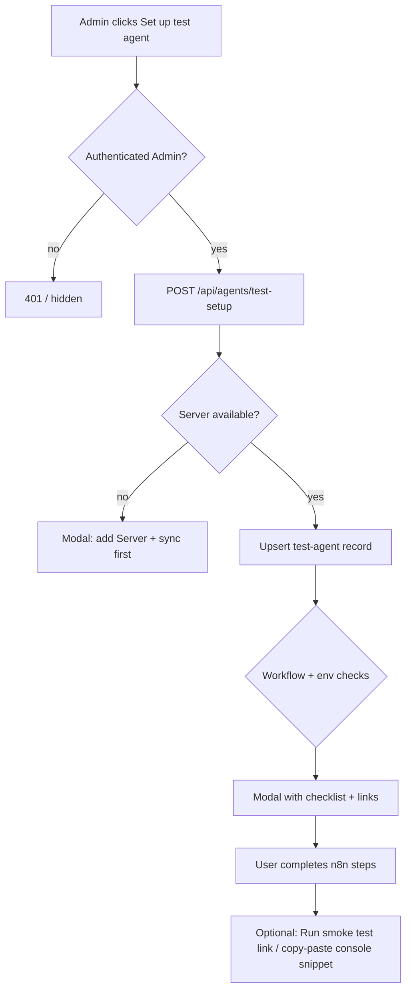

# Test Agent Button Plan

This document plans a **Set up test agent** control next to the existing **Sync n8n data now** button on the admin dashboard welcome banner. It is based on what is already implemented and documented in [agent-harness-user-guide.md](./agent-harness-user-guide.md), [agent-harness-testing.md](./agent-harness-testing.md), [monitoring-user-guide.md](./monitoring-user-guide.md), and the existing `SyncButton` in `src/components/BeforeDashboard/SyncButton/`.

## Summary

**Yes — a button can be added next to Sync**, but it can only automate the **Payload side** of test setup. n8n still requires a published Webhook or Chat Trigger workflow, a matching bearer secret, and (for async tests) `N8N_CALLBACK_SECRET`. The button should therefore:

1. **Create or update** a canonical `test-agent` `Agents` record with documented defaults.
2. **Check prerequisites** (server, workflow, env vars) and report what is missing.
3. **Show step-by-step n8n instructions** in a modal or expandable panel so the admin knows exactly what to do outside Payload.

Payload cannot publish workflows in n8n, set deployment environment variables, or guarantee invocation until the n8n workflow exists and is active.

## Current Baseline

| Area | Today |
| --- | --- |
| Dashboard actions | `BeforeDashboard` renders `SyncButton`, which calls `POST /api/n8n/sync?resource=all`. |
| Agent registry | `agents` collection with server/workflow relationships, transport, endpoint path, secret reference, limits, and role gating. |
| Invocation | Authenticated harness routes under `/api/agents/:slug/sessions` and `/api/agent-sessions/:id/messages`. |
| Manual test flow | [agent-harness-testing.md](./agent-harness-testing.md) documents the full manual path: create n8n workflow → register agent in admin → browser/API smoke tests. |
| Seeded bootstrap | `onInit` seeds roles and a default dashboard; it does **not** seed agents or n8n workflows. |

The harness plan ([n8n-agent-harness-plan.md](./n8n-agent-harness-plan.md)) also called out **manual test invocation restricted to Admin** as a dashboard UX item. This button is a concrete, onboarding-focused version of that idea.

## What The Button Can And Cannot Do

### Can do (Payload)

- Upsert an `Agents` document with stable defaults (see [Canonical test agent](#canonical-test-agent)).
- Pick the first **sync-enabled, online** `servers` record, or the only server, or return a clear error if none exist.
- Pick a matching `workflows` record by name/path heuristics, or leave workflow unset and instruct the user to sync then re-run.
- Verify (server-side) that referenced env vars exist: `TEST_AGENT_WEBHOOK_SECRET`, optionally `N8N_CALLBACK_SECRET`.
- Return structured **next steps** and deep links (edit agent, Agents list, agent-harness testing doc anchor).
- Optionally offer **Sync workflows first** as a sub-action when no suitable workflow is found (reuse existing sync endpoint with `?resource=workflows`).

### Cannot do (n8n / host)

- Create, import, or activate an n8n workflow.
- Choose or rotate n8n credential values inside n8n.
- Set `TEST_AGENT_WEBHOOK_SECRET` or `N8N_CALLBACK_SECRET` in the deployment environment.
- Prove end-to-end invocation without the user completing the n8n steps below.

## UX Design

### Placement

Add `TestAgentButton` beside `SyncButton` inside `BeforeDashboard__actions` (flex row with gap already defined in `index.scss`).

```
[ Sync n8n data now ]  [ Set up test agent ]
```

### Visibility

- **Admin only** (matches agent create/update access and the testing guide’s admin prerequisite).
- Hide or disable for Content Manager / Customer (same pattern as agent admin operations).

### Interaction flow



### Modal content (checklist)

Present a ordered checklist derived from [agent-harness-testing.md](./agent-harness-testing.md):

1. **Environment** — Set `TEST_AGENT_WEBHOOK_SECRET` (and `N8N_CALLBACK_SECRET` if testing async callbacks). Show whether each is present on the server (boolean only; never show values).
2. **n8n workflow** — Create or open a production Webhook workflow:
   - Method: `POST`
   - Path: `/webhook/test-agent` (or the path stored on the agent)
   - Auth: Header Auth / Bearer matching `TEST_AGENT_WEBHOOK_SECRET`
   - Response body example (copy button):

     ```json
     {
       "content": "Harness response received",
       "status": "succeeded",
       "n8nExecutionID": "manual-test-execution"
     }
     ```

   - **Activate** the workflow (production URL, not `/webhook-test/`).
3. **Sync** — Run **Sync n8n data now** (or the button’s optional workflow sync) so the workflow appears in Payload.
4. **Payload agent** — Confirm the `test-agent` record was created/updated; link to `/admin/collections/agents/<id>`.
5. **Verify** — Expandable “Run smoke test” with the browser console snippets from the testing guide, or a one-click **Open test dashboard** link if a page with an Agent Chat block is seeded later.

Use success/warning icons per checklist item based on API response flags (`serverOK`, `workflowOK`, `secretOK`, `agentOK`).

### Error states

| Condition | User-facing message |
| --- | --- |
| No servers | “Add a Server with sync enabled, then sync.” |
| No workflows after sync | “Create and activate the test webhook in n8n, then sync workflows.” |
| Missing `TEST_AGENT_WEBHOOK_SECRET` | “Set this env var and restart the app before invoking the agent.” |
| Agent slug conflict with different config | “An agent with slug `test-agent` already exists; opened existing record.” (idempotent update, no duplicate) |
| Non-admin | Button not rendered |

## API Design

### `POST /api/agents/test-setup`

Authenticated **Admin** endpoint (session cookie). Returns setup status and instructions; does not invoke n8n.

**Optional query/body**

| Param | Purpose |
| --- | --- |
| `serverID` | Target a specific server; default first sync-enabled server |
| `syncWorkflows` | When `true`, run workflow sync for that server before resolving workflow |
| `endpointPath` | Override default `/webhook/test-agent` |

**Response (example)**

```json
{
  "ok": true,
  "agent": { "id": "...", "slug": "test-agent", "adminURL": "/admin/collections/agents/..." },
  "checks": {
    "serverOK": true,
    "workflowOK": false,
    "testAgentSecretOK": true,
    "callbackSecretOK": false
  },
  "server": { "id": "...", "name": "Local n8n" },
  "workflow": null,
  "instructions": {
    "n8nWebhookPath": "/webhook/test-agent",
    "n8nResponseExample": { "content": "...", "status": "succeeded" },
    "envVars": ["TEST_AGENT_WEBHOOK_SECRET", "N8N_CALLBACK_SECRET"]
  },
  "message": "Agent record ready. Complete the n8n checklist to invoke."
}
```

**Implementation notes**

- Use `req.payload.create` / `update` with `req` for transaction safety.
- Resolve `User` role ID for `allowedRoles` (same as testing guide).
- Match existing agent by `slug: test-agent`; update in place rather than failing on duplicate.
- Do not store secret values; only `secretReference: TEST_AGENT_WEBHOOK_SECRET`.
- Workflow match priority: exact webhook path in synced metadata → name contains “test” → most recently synced workflow on that server (last resort with warning in `configurationWarning`).

## Canonical Test Agent

Defaults aligned with [agent-harness-testing.md](./agent-harness-testing.md):

| Field | Value |
| --- | --- |
| `name` | `Test Agent` |
| `slug` | `test-agent` |
| `enabled` | `true` |
| `transport` | `webhook` |
| `endpointPath` | `/webhook/test-agent` |
| `authStrategy` | `server-secret` |
| `secretReference` | `TEST_AGENT_WEBHOOK_SECRET` |
| `allowedRoles` | `User` (plus Admin always passes) |
| `inputMode` | `chat` |
| `streamingEnabled` | `false` (simplest first slice; document how to enable for SSE tests) |
| `maxRunsPerMinute` | `12` |
| `maxConcurrentRuns` | `1` |
| `maxRunsPerDay` | `100` |
| `timeoutMS` | `30000` |
| `maxInputBytes` | `20000` |
| `welcomeMessage` | Short onboarding text pointing to the checklist |

If `workflow` cannot be resolved, still create the agent with `configurationWarning` set so admins see drift in the collection.

## Security

- **Admin-only** endpoint and UI; reuse `checkRole(['Admin'], user)`.
- Never return env var values, server `apiKey`, or n8n secrets in the response.
- Do not auto-invoke the agent from this endpoint (avoids accidental upstream calls during misconfiguration).
- Instructions must emphasize **production** webhook paths; `/webhook-test/` is rejected at invocation time per harness validation.
- Idempotent upsert only; no delete/recreate of existing sessions or runs.

## Implementation Phases

### Phase 1 — Docs and API (this plan)

- [x] Plan document (this file).
- [x] `POST /api/agents/test-setup` handler in `src/endpoints/testAgentSetup.ts`.
- [x] Unit tests for workflow matching and idempotent upsert logic in `src/n8n/agents/testAgentSetup.ts`.

### Phase 2 — Admin UI

- [x] `TestAgentButton` client component next to `SyncButton`.
- [x] Modal/checklist using `@payloadcms/ui` (`Button`, `CopyToClipboard`, toast).
- [x] Wired into `BeforeDashboard` with Admin gate via `useAuth`.

### Phase 3 — Polish

- [x] Optional **Sync workflows first** action on the modal.
- [x] In-app help text mirroring [agent-harness-testing.md](./agent-harness-testing.md).
- [x] Updated [agent-harness-user-guide.md](./agent-harness-user-guide.md) and [agent-harness-testing.md](./agent-harness-testing.md).
- [x] Shared setup guide on the **Agents** edit/create sidebar for manually created agents.
- [ ] Optional: seed a “Agent test” dashboard page with an `agentChat` block targeting `test-agent` when setup completes (deferred follow-up).

## Testing

Manual (extends [agent-harness-testing.md](./agent-harness-testing.md)):

1. Admin with no servers → button shows “add server” guidance.
2. Server, no workflow → agent created with warning; checklist shows n8n + sync steps.
3. Full setup → agent linked, secrets OK, smoke test snippets succeed.
4. Non-admin → button hidden.
5. Re-click → idempotent update, no duplicate agents.

Automated (extends [testing.md](./testing.md)):

- Integration test for `POST /api/agents/test-setup` with mocked payload (Admin vs non-admin, upsert behavior).
- Optional e2e: admin dashboard shows button and opens modal (Playwright).

## Open Questions

1. **Streaming test agent** — Ship non-streaming first (recommended in [n8n-agent-harness-plan.md](./n8n-agent-harness-plan.md)); add a second preset or toggle later for SSE testing.
2. **Chat Trigger variant** — Keep v1 Webhook-only; document Chat Trigger as an advanced manual alternative.
3. **Multi-server** — Default to first sync-enabled server; add server picker in modal if multiple exist.
4. **Importable n8n workflow JSON** — [docs/n8n-workflows/](./n8n-workflows/README.md) (`test-agent-webhook.json` and related samples).

## Related Docs

- [agent-harness-user-guide.md](./agent-harness-user-guide.md) — agent fields and API
- [agent-harness-testing.md](./agent-harness-testing.md) — manual verification steps the button should surface
- [monitoring-user-guide.md](./monitoring-user-guide.md) — servers, sync endpoints, `SyncButton` context
- [n8n-agent-harness-plan.md](./n8n-agent-harness-plan.md) — original “manual test invocation” UX note
